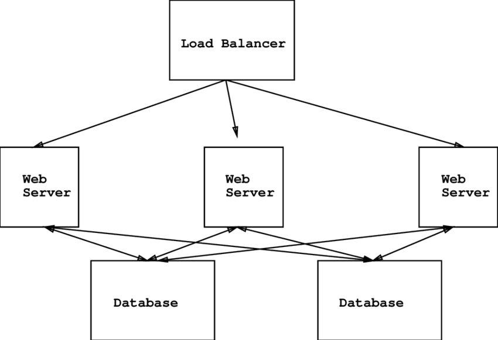

#TP Docker

## Run Project

``` 
$ docker swarm init
$ docker stack deploy -c docker-compose.yml swarmnodeapp
```

## Stop Project

``` 
$ docker stack rm swarmnodeapp
$ docker swarm leave --force
```


## Choix techno

* Docker swarm => orchestration de container
	Outil qui facilite l’orchestration des conteneurs docker et permet d’en ajouter selon la demande (Load balancing). On pourra donc scaler l’application selon le nombre de connections par exemple

* ReactJs => font-end 
	Facebook Pinterest Instagram Snapchat,discord,airbnb,redit slack, Netflix utilisent react.

* NodeJs => back-end
	Utilisé par redit et Slack, j’ai surtout choisi cette techno quand cela permet avec reactJs d’avoir une équipe de développement qui travaille essentiellement avec du javascript ce qui permettra d’avoir un groupe d’expert polyvalent.
Python Django pourrait aussi être utilisé, c’est d’ailleurs le cas pour plusieurs site de type réseaux sociaux.

* Base de données => mongo DB 
	Comme le projet est jeune et s’attaque a un marché concurrentiel, le noSql permettra un développement plus rapide et permettra de modifier la structure de données plus simplement.
Le NoSQL est plus simple a partager entre plusieurs serveur , ainsi cela favorise une scalabilité horizontale.

## Architecture
Pour l’architecture nous aurons un proxy nginx qui fera office de load balancer. 3 (ou plus) instances de l’api qui seront orchestrées a l’aide de swarm. En effet il suffit d’augmenter le nombre de replica si la demande est forte. D’une autre part, swarm s’occupera de relancer un container qui sera down.
Nous aurons aussi deux bases de données mongodb, une pour la partie business et l’autre pour les logs.
Pour chaque bases de données, il y aura une instance de mongo express qui est une interface graphique permettant la gestion de nos données.
Pour finir, une application avec le framework reactJs en front end


